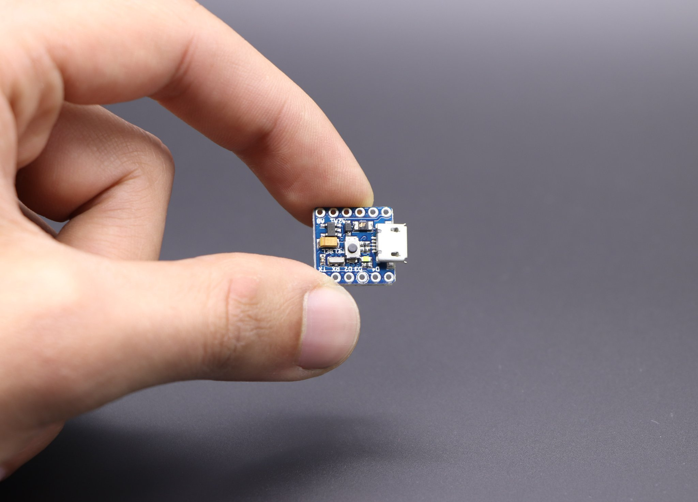
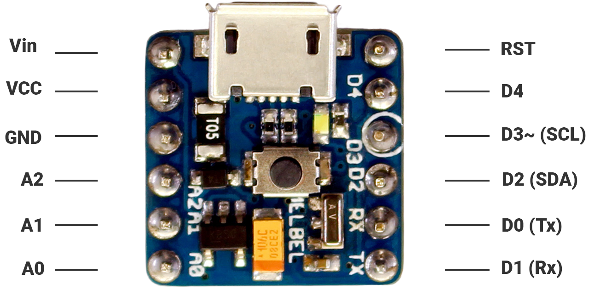
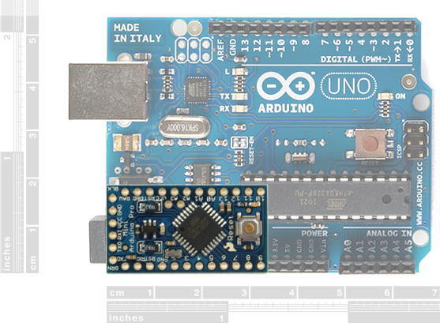
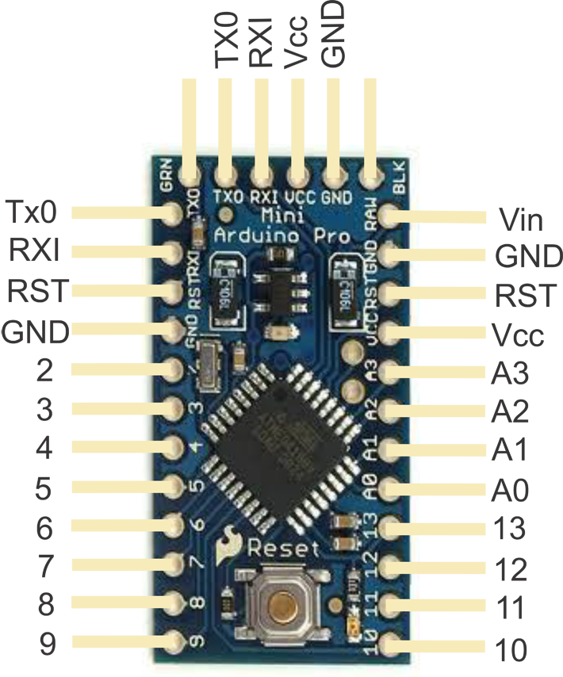

# Arduino (compatible) Boards

## Melbel Pico

https://mellbell.cc/products/pico

"World's smallest Arduino" is a tiny Leonardo-compatible board.

## Arduino Pro Mini

https://www.engineersgarage.com/electronic-components/arduino-pro-mini-pinout

https://learn.sparkfun.com/tutorials/using-the-arduino-pro-mini-33v