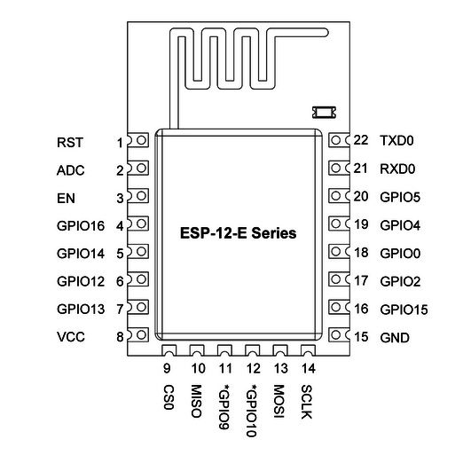
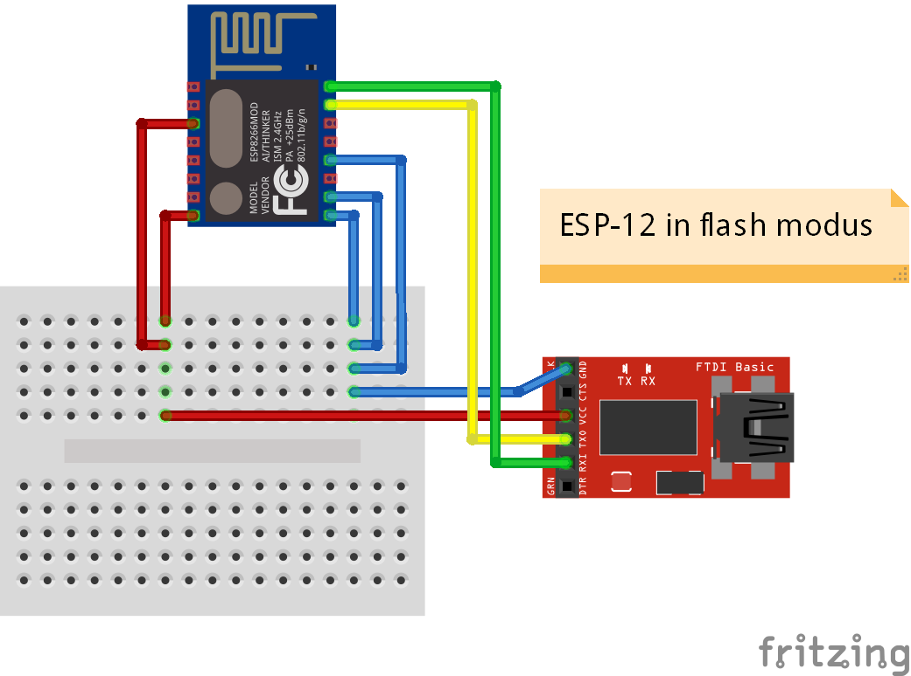

# ESP8266

## ESP8266 12E Pinout

## Hookup and Programming

Basic wiring of an ESP8266 12E module.

Boot modes are controlled as follows:

- Boot from SD card (not used much): CHPD pin (3rd down on the left) not connected.
- Boot from internal flash memory (normal boot): CHPD pin pulled high (3.3V), GPIO0 (4th pin from bottom right) not connected.  For most normal uses CHPD pin should always be pulled high.
- Boot into flash (programming) mode: GPIO0 pulled to ground.

https://www.youtube.com/watch?v=4tIopaejG-s

Create a Reset button that pulls the REST pin to ground when pressed.  Normally, the reset pin can be pulled to high.

Create a Program button that pulls GPIO0 to ground.  To program, press the reset and program buttons, then release the reset button about .5 seconds before releaseing the program button.

