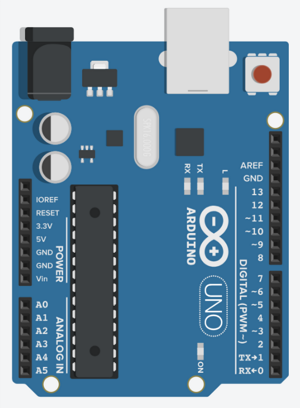
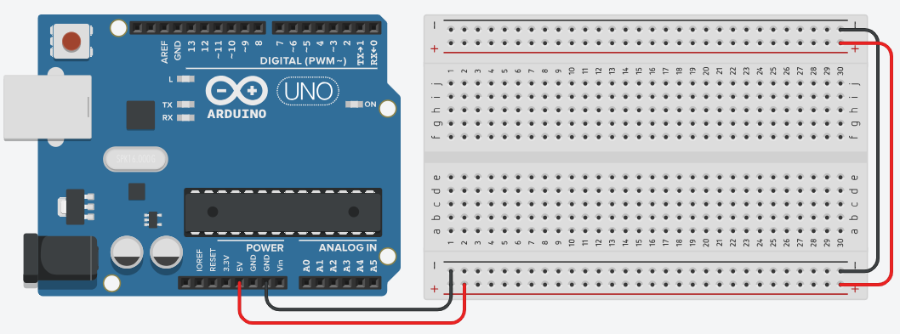
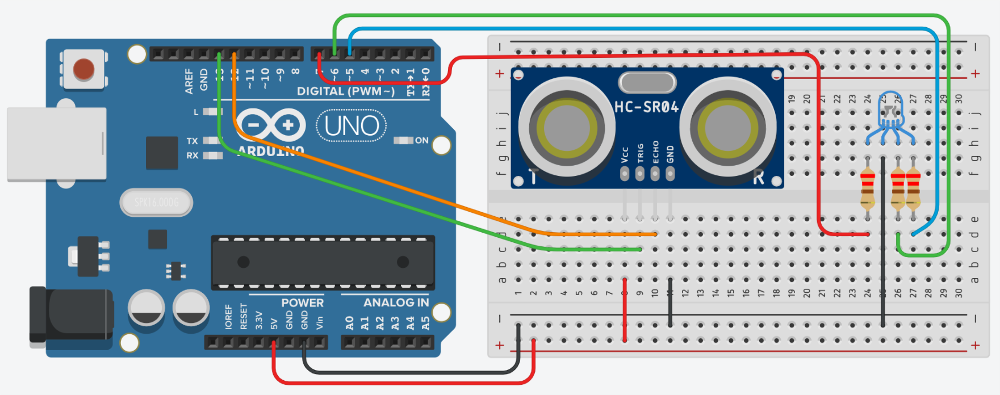

# Making Things with Arduino Workshop

#### Table of Contents

[Introduction](#introduction)

[What We Will Learn](#what-we-will-learn)

[The Basics of Arduino](#the-basics-of-arduino)

[The Arduino Development Environment](#the-arduino-development-environment)

[Project 1 - Arduino Hello World](#project-1-arduino-hello-world)

[Project 2 - Using a Distance Sensor](#project-2-using-a-distance-sensor)

[Glossary and Reference](#glossary-and-reference)


----

## Introduction

Building fun electronic projects is a great way to jumpstart your imagination and creativity, which benefits both work and life. This workshop will be an introduction to the amazing world of DIY electronics. It will introduce you to the Arduino ecosystem, which provides an easy, friendly platform to learn the basics of electronics, prototyping cool gadgets, and IoT (Internet of Things).

You will learn how to build your own projects using motion sensors, temperature and humidity sensors, and LEDs, and how to find and use resources that will help you build anything you can imagine!

No experience with electronics or coding is required, and everything you need to participate in the workshop will be provided in a kit that you can also take home for future tinkering.

The workshop provides a [complementary kit](https://goo.gl/FcvwX3) provided to workshop participants, which contains an Arduino UNO R3 (clone) board and a number of interesting components.  It is meant to be suitable for beginners, while also providing the basis for some interesting projects.

The kit contains the following:

- Arduino UNO R3 board
- Breadboard
- Ultrasonic distance sensor
- Temperature and humidity sensor
- Buzzer
- Button
- RGB LED
- Resistors
- Jumper wires
- USB cable


## What We Will Learn

**Basics of Arduino**: 

We'll go over a short history of Arduino, Arduino boards, the development environment, and a 10,000 foot view of the Arduino ecosystem.

> TODO


----

## The Basics of Arduino

> TODO


### The Board



> TODO


### Working with a Breadboard




## The Arduino Development Environment

> TODO
>
> - IDE
> - Web Editor
> - Drivers
> - Ports
> - Development Process
> - Connecting your board, selecting the board and port in the IDE


### Bare Minimum About Electricity

> TODO


### Setting Up Your Arduino Environment

> TODO

https://www.arduino.cc/en/Main/Software

Download and install, or use web editor (requires signup)

https://create.arduino.cc/


----

## Project 1: Arduino Hello World

### What We'll Build

The traditional first program someone writes when learning a new programming language is the venerable "Hello World!" program.  It is the bare minimum program that simply prints "Hello World!" to the screen.  With Arduino, this traditional first project is **Blink** - a circuit that simply blinks an LED.

This diagram shows how what the circuit will look like.


### Getting Ready

For this project, we're going to need the following:

- Arduino board.
- 1 LED.  Any color LED is fine.  If you will be using an RGB LED (a single LED that can display red, green, and blue), then we will be using a single color only.
- 1 100 Ohm resistor.  Any value is fine for now, but a value of 100 - 220 Ohms would be preferable.
- Jumper wires.
- Arduino IDE - installed and configured.  The Arduino Web Editor is a great alternative that requires a minimal installation of a browser plugin, but requires an account on the Arduino.cc website.


### Build It

**Wire up the circuit**

Construct the LED circuit as shown in the diagram:

1. Insert the LED into the breadboard as shown, so that the longer leg (the positive lead) is on the right.
2. Connect a jumper wire to one of the ground (**GND**) pins of the Arduino, and the connect the other end of the wire to the same terminal strip (column) as the left leg of the LED (i.e. one of the holes in the same column as the LED's left leg).
3. Connect the resistor in the breadboard so that on end is in the same terminal strip as the positive leg (right side) of the LED.
4. Connect  a jumper wire between pin 9 of the Arduino and right leg of the resistor.


**Write the code**

Now that the circuit is wired up, we need to tell the Arduino how to flash the LED.

Launch the Arduino IDE (or the Web editor).  By default, the IDE will open a new "Sketch" with a generated name.  If you are using the Web editor, click the New Sketch button.  

Replace the contents of the Sketch in the editor with the following code:

```c
void setup() {
  	pinMode(9, OUTPUT);
}

void loop() {
  	digitalWrite(9, HIGH);    
  	delay(1000);  
  	digitalWrite(9, LOW);    
  	delay(1000);
}
```

Save the Sketch using <kbd>Ctrl</kbd>+S  (<kbd>Cmd</kbd>-S on a Mac).  You will be prompted to enter a new name for the Sketch.  Enter a good name - like "HelloWorld" or "Blink".


**Upload The Code**

Now that the code is written, we need to compile it and get it onto the board.

Make sure that you board is connected to your computer with a USB cable.  Then ensure that your board is selected and configured in the IDE using the <kbd>Tools -> Board</kbd> and <kbd>Tools -> Port</kbd> menus. 


To compile and upload the code, click on the **Upload** button.


>  The keyboard shortcut for uploading is <kbd>Cmd</kbd>+U on the Mac, and <kbd>Ctrl</kbd>+U on Linux/Windows.

This will compile the code to a "hex" file that is executable by the microcontroller on the Arduino board, then upload the file to the board.  The IDE displays progress indicators about the compile and upload.

Once the upload successfully completes, the Arduino will automatically start executing the code, and you should see the LED blinking!


### How It Works

Arduino programs are written in the C or C++ programming languages.  One of the goals of the Arduino creators was to provide a programming environment that would be relatively easy for people with little or no programming experience to get things done quickly.  At the time, microcontrollers were expensive and were programmed with assembly language or C with complicated tools and processes.  The Arduino language is still C, but with wrapped inside a simple (relatively) IDE and compiler toolset, with a rich, but simple set of built-in functions.  Instead of having to worry about tons of C code that interacts with the Arduino's hardware, Arduino programs typically contain (or begin with) two simple C functions that the Arduino system calls.

```c
void setup() {
    
}

void loop() {
    
}
```

The ```setup()``` function runs when the Arduino is first powered on or reset, and runs only once. It is used to do initialization and anything else that should only be performed once.

The ```loop()``` function repeats continuously, and is the actual "meat" of your project.  It is basically an infinite loop that runs from to to bottom, then starts at the top again.  This is important to keep in mind when thinking about how you structure the code in this function and how it affects the behavior of your project.

When an Arduino Sketch, as projects are called, is compiled, it is first translated to pure C, combined with all the built-in code and wrappers Arduino provides, then finally compiled to a "hex" file specifically for the particular board you select.  Hex files contain the raw, binary executable code that the microprocessor executes.

Simple projects, like our Blinky, contain only setup() and loop(), but as we get into more complicated projects, we'll start ... C-ing more. ;D

Now, let's see how the code for our project works.

First, we have the ```setup()``` function:

```c
void setup() {
  	pinMode(9, OUTPUT);
}
```

This code calls the built-in Arduino ```pinMode()``` function, which configures a pin on the board to behave a certain way.  In this case, we are telling the Arduino that we intend to use pin **9** for **OUTPUT**, meaning we'll be sending data to the pin rather than reading data.  LEDs are output devices, since we send signals to them telling them to turn light up.  An LED is a light emitting diode, meaning that it lights up when an electric current flows through it. 

This code is typical of what you would find in ```setup()```.

After ```setup()``` finishes, the Arduino then runs the ```loop()``` function repeatedly until it is reset or powered off.  Let's look at the code in ```loop()```.

```c
digitalWrite(9, HIGH);    
delay(1000);  
digitalWrite(9, LOW);    
delay(1000);
```

The code calls Arduino's built-in function ```digitalWrite()```, which sets the state of a specified *digital* pin - digital pins can either be on or off. The first parameter to the function specifies the pin number on which to act, and the second parameter specifies the value to which the pin should be set.  Digital pin values can either be ```HIGH``` (full voltage, or **on**) or ```LOW``` (no voltage, or **off**).  The first call - ```digitalWrite(9, HIGH)``` - tells the Arduino to set pin 9 to the ON state.  Once this line is executed, the LED will turn be on.

Next, we see a call to the built-in ```delay()``` function, which tells the Arduino to basically do nothing for a specified number of milliseconds.  So ```delay(1000)``` means do nothing for 1 second.

The next line of code says ```digitalWrite(9, LOW)```, which sets pin 9 to the **off** state.  The LED's light will now be off.

The effect of these 3 lines of code is that to flash the LED for 1 second by turning it on, waiting 1 second, then turning it off.

But then, why do we need that second call to ```delay(1000)``` at the end of the ```loop()``` function?  Remember that the ```loop()``` function runs repeatedly, so as soon as the last line of code is run, it will start again at the first line.  If there was no delay after we turn off the LED, the effect will be that it would be off for a tiny fraction of a second before the first line runs and turns it back on.  To the human eye, the LED would be always on!.

Experiment with the value of the last delay() call - e.g. delay(2000), delay(100), etc - to see how it affects the behavior of the LED.


### Going Further

The code we have for the "Hello World" blinky LED is ok, but we can do better.  What if we want to do something like 4 rapid flashes followed by a long delay, or a number of rapid flashed punctuated by a longer flash?  Or what if we have multiple LEDs we want to flash?  The code could become long and unwieldy pretty quickly.

Let's refactor the code a bit to make things easier and cleaner:

```c
const int LED_PIN = 9;

void flash(int pinToFlash, int duration) {
    digitalWrite(pinToFlash, HIGH);
    delay(duration); 
    digitalWrite(pinToFlash, LOW);
    delay(duration);
}

void setup() {
    pinMode(LED_PIN, OUTPUT);
}

void loop() {
    flash(LED_PIN, 250
    flash(LED_PIN, 250);
    flash(LED_PIN, 1000);
}
```

We've defined our LED pin on one place by creating a *constant*.  Now, if we want to use a different pin we need to change only one place in the code.

We've extracted the code that flashes the LED into its own function with parameters to specify the pin we want to flash and how long the flash should be.  This allows us to easily add flashes in our code with a single line of code instead of 4.

In the ```loop()``` function, we can now do some fancy stuff like do 2 rapid flashes followed by a longer flash.  Notice that the final delay() call was also removed, since the delay is built into the flash() function!

**Going Even Further**

As an exercise, try building a circuit with multiple LEDs that flash in sequence.  Or build a traffic light with red, yellow, and green LEDs.


----

## Project 2: Using a Distance Sensor

### What We'll Build

For this project, we'll use the ultrasonic distance sensor to build a device like a parking assistant that will let us know when we are within a good distance from the wall, when we're getting too close, and when should really just stop the car before we put a hole in the wall.

The device will:

- Turn on a green LED when we get within a certain maximum distance from the sensor
- Turn on a yellow LED when we get within the "getting close" range
- Turn on a red LED when we've reached the minimum distance

The final circuit for this project will look like this:



While building this project, we will also learn some new and important Arduino development skills.  We'll see how to use the Serial Monitor to see what's going on in our code while it's running on the Arduino.  We'll also learn how to use libraries (additional, 3rd party code) to simplify working with components like sensors.


### Getting Ready

We're going to need:

- Our Arduino board
- 1 US-015 ultrasonic distance sensor
- 3 LEDS (red, green, and yellow) or 1 RGB LED
- 3 100K resistors


### Build It

We're going to build this project in two steps.  The first step is working with the distance sensor, while also learning how to use the Arduino IDE's Serial Monitor to debug our code and get feedback about what's happening on the board.

The first step of our build will look like this:

 


**Wire Up The Circuit**

1. Wire up the power from the Arduino to the breadboard.
    1. Connect a red jumper wire from the **5V** pin on the Arduino to the +ve (red) power rail on the breadboard
    2. Connect a black jumper wire from one of the **GND** pins on the Arduino to the -ve (black or blue) breadboard power rail
2. Connect the US-015 distance sensor to the breadboard as shown in the diagram by inserting its pins into the breadboard.  Take note of the sensor's 4 pins - VCC (power), Gnd (ground), Trig (trigger), and Echo.
3. Connect a jumper wire from the +ve power rail to the sensor's VCC pin.
4. Connect a jumper wire from the -ve power rail to the sensor's Gnd pin.


**Write The Code**

Create a new Sketch in the Arduino IDE and add the following code.  We'll go over how this code works later.

```c
const int triggerPin = 13;
const int echoPin = 12;

int inches = 0;
int cm = 0;

void setup() {
    Serial.begin(9600);

    pinMode(triggerPin, OUTPUT);
    pinMode(echoPin, INPUT);
}

void loop() {
    // Clear the trigger
    digitalWrite(triggerPin, LOW);
    delayMicroseconds(2);

    // Send an ultarasonic ping for 10 microseconds
    digitalWrite(triggerPin, HIGH);
    delayMicroseconds(10);
    digitalWrite(triggerPin, LOW);

    // Reads the echo pin, and returns the sound wave travel time in microseconds
    int pingTime = pulseIn(echoPin, HIGH);

    // Convert the ping time to distance in centimeters
    cm = 0.01723 * pingTime;

    // Convert centimeters to inches
    inches = (cm / 2.54);

    Serial.print("Distance: ");
    Serial.print(cm);
    Serial.print(" cm or ");
    Serial.print(inches);
    Serial.println(" inches");

    // Wait for a short while before reading the sensor again
    delay(100);
}
```


**Upload The Code**

Compile and upload the code to your Arduino.  Once the upload is done, how do we know what it's doing?  We can't see anything happening!  This is where the Arduino IDE's Serial Monitor comes into play.

Open the Serial Monitor in one of the following ways:

1. Go to the <kbd>Tools</kbd> menu and select <kbd>Serial Monitor</kbd>
2. Use the keyboard shortcut.  On the Mac, use <kbd>Cmd</kbd>+<kbd>Shift</kbd>+M.  On Linux or Windows, use <kbd>Ctrl</kbd>+<kbd>Shift</kbd>+M.

This will open a new window, and you may already start seeing text being output in the main area.  If nothing is being output or you see garbage, then the we may need to tweak the configuration of the Serial Monitor so it talks to the Arduino at the right speed. 


Look at the bottom, right corner of the Serial Monitor window.  The second item from the right is a dropdown that says "115200 baud".  Let's go back to the first line of the ```setup()``` function in the code:

```c
Serial.begin(9600);
```

This code is setting up a connection  to the Arduino at a speed of 9,600 baud.  The Serial Monitor needs to also be set to the same speed for things to work.  To fix this, click the dropdown and select "9600 baud". Soon we should see good text coming from our board!


If all is well, our sensor should be reading the distance of of whatever is directly in front of it and we should be seeing the distances being printed out!  Experiment a bit by moving an object towards and away from the sensor to see what happens.


### How It Works

This little project has introduced two new things so far - debugging Arduino projects using the Serial Monitor, and working with a cool sensor!  Let's dig into each one so see how they work.

#### Serial Monitor

The serial connection between an Arduino board and the computer it is connected to (via a USB cable) is used typically to send information from the Arduino to the PC so we can see what's going on in our Sketch as it runs. Data can also go from the PC to the Arduino over the serial connection, but that's beyond the scope of this project.

Before it can be used, the serial connection must be initialized, or set up.  In our first project, we learned about where we need to put any initialization or setup code in our Sketch.  Remember?  That's right - in the ```setup()``` function.

```c
void setup() {
    Serial.begin(9600);
    . . .
```

This line in the setup() function sets up our serial connection.  ```Serial.begin()``` starts the connection, and takes as its parameter, a number representing the speed at which we would like to communicate to the PC.  In this case, it is 9,600 baud.  That brings back memories of 1990's dialup connections! This is fast enough for basic debugging, but we can bump the speed up a bit if we're going to be rapidly sending lots of sensor data to the PC.

Remember, as we discussed before, that the Serial Monitor in the Arduino IDE must be set to the same speed.

Once our connection is set up, we can then sprinkle ```Serial.print()``` and ```Serial.println()``` calls anywhere in our code where we would like to send interesting information to the Serial Monitor for us to see.  We see this in action from lines 33 to 37.  We first call ```Serial.print("Distance: ");```, which just writes that text to the Serial Monitor.  Then we call ```Serial.print(cm);```, which writes out the value that is stored in the ```cm``` variable. The next lines writes out the text " cm or ", then the value of the ```inches``` variable, then finally the text " inches".  Important to note here is that the first four lines call ```Serial.print()```, while the last line calls ```Serial.println()```.  The difference is that "print()" writes what it's told and leaves the "cursor" on the same line.  "println()", on the other hand, writes what it's told, then goes to the next line, like hitting <kbd>Enter</kbd> at end of a line of text.

Using Serial.print() or Serial.println() is a good way to see what the value of variables are at any given point, or to simply to see where the program is and what it is doing.

#### Interacting with the Sensor

The distance sensor uses the same technique as dolphins or submarines - it sends out a high-pitched burst of sound, then waits to hear the echo.  Once it gets the echo, it figures out the amount of time that passed between when the ping and the echo.  Knowing the speed of sound, we can then calculate the distance of the thing that the sound bounced off of (which is basically the distance it takes for sound to travel in half the time between the ping and the echo).

Now we're experts on sonar, so we can look at the code to see how our sensor works!

So we know that we need to send a ping, and receive an echo.  Therefore, the sensor contains a sound generator (called a trigger) and what's basically a microphone to detect the echoed sound.  The sensor has two pins for controlling these functions - a trigger pin, which is our output, and an echo pin, from which we can read our reply or input.  The code on lines 1 and 2 define constants representing our trigger pin (pin 13) and echo pin (pin 12).  These can be any of the Arduino's available digital pins, but 12 and 13 are just the ones we're using in this project.

As we discussed previously, we need to tell the Arduino how we intend to use pins.  Where do we do this type of initialization or setup work?  That's right - the ```setup()``` function.  Looking at ```setup()```, we see two lines of code that do this:

```c
	pinMode(triggerPin, OUTPUT);
    pinMode(echoPin, INPUT);
```

These configure our trigger pin as OUTPUT, and our echo pin as INPUT.

Now let's look at the ```loop()``` function to see how we work with the sensor.  Notice:

- First, we must initialize the sensor and tell to to get ready to do a ping/echo session.  We do this with a ```digitalWrite(triggerPin, LOW);```, then a delay for a short time to give the sensor enough time to initialize.
- We then turn on the trigger pin by setting it to HIGH, wait 10 milliseconds, then turn it off by setting it to LOW.  This has the effect of sending 10 millisecond ultrasonic burst.
- Next we have a call to ```pulseIn(echoPin, HIGH);```, which says "Read the echoPin until it gets turned on (set to HIGH)", which will happen when the sensor detects the echo.  What gets returned from this call is the duration between the ultrasonic burst and when it heard the echo.
- Oh, we're not done yet!  Now we need to break out our high school physics to figure out the distance from the duration using the speed of sound:  ```cm = 0.01723 * pingTime;```.  This gives us the distance in centimeters, because, inches are so last century!  Ok, fine.  For the Americans in the room, line 31 converts centimeters to inches:  ```inches = (cm / 2.54);```


### Going Further

#### Using a Library

Our code so far is quite lengthy and complicated.  We need to know how to initialize the sensor, send an ultrasonic ping for a given length of time, wait for the echo, and understand the speed of sound so we can then figure out how far away an object is by calculating the time taken for the ultrasonic burst to echo back to the sensor. We even have some code to convert centimeters to inches.  

***Whew!*  There must be a better way.**

There is. One of the basic truths of technology is that no matter what problem you have, someone somewhere has already solved it. (Or at least a part of it or something similar or...)  

This is where libraries come in. A library is a package of code that someone has already created to solve a problem or make something easier, and were kind enough to put it out there for us to use. Let's use a cool library called **[NewPing](https://bitbucket.org/teckel12/arduino-new-ping/wiki/Home)** that makes working with distance sensors really simple.

Before we can use a library, we need to install it into our Arduino environment.  Open the library manager in the Arduino IDE by going to the <kbd>Sketch</kbd> menu and selecting the <kbd>Include Library</kbd> -> <kbd>Manage Libraries...</kbd> option.  (The keyboard shortcut to open the library manager is <kbd>Ctrl</kbd>+<kbd>Shift</kbd>+I on Windows  and Linux, or <kbd>Cmd</kbd>+<kbd>Shift</kbd>+I on Mac.)

Once the library manager window is up, enter "ultrasonic" into the "*Filter your search...*" box.  A list of matching libraries will be displayed.  Scroll through the list and check out the descriptions and functionality of the various libraries.  We should see an entry for the **NewPing** in the list.  It describes the library, and provides a link to a library's home page. 

Click on the "Install" button at the bottom of the library's information block.  Close the window once the library is installed.

Now go to the <kbd>Sketch</kbd> menu again, hover over the <kbd>Include Library</kbd> option, then find and click on "NewPing" in the list. We should a new line get added to the top of our code:

```c
#include <NewPing.h>
```

Now let's refactor our code to use the library.  The final code should look something like this:

```c
#include <NewPing.h>

const int triggerPin = 13;
const int echoPin = 12;
const int maxDistance = 500;

int inches = 0;
int cm = 0;

NewPing sonar(triggerPin, echoPin, maxDistance); 

void setup() {
    Serial.begin(9600);
}

void loop() {
    // Get the distance reading in centimeters
    cm = sonar.ping_cm();

    // ..Or we if we want to get the distance reading in inches
    inches = sonar.ping_in();
   
    Serial.print("Distance: ");
    Serial.print(cm);
    Serial.print(" cm or ");
    Serial.print(inches);
    Serial.println(" inches");

    // Wait for a short while before reading the sensor again
    delay(100);
}
```

Wow!  That's a lot cleaner, and we don't have to know the physics of sound!

Notice a few interesting things about the new code:

- We no longer need to initialize the triggerPin and echoPin in the ```setup()``` function.  Instead, we now simply supply triggerPin and echoPin to the new code on line 10:  ```NewPing sonar(triggerPin, echoPin, maxDistance);``` This declares a new variable called of type NewPing.  This is a class defined by the NewPing library that wraps all the details of working with ultrasonic sensors.  This line defines a new object called "sonar", which we have initialized with our sensor pins and the maximum distance we care about detecting.  (As an exercise, read the documentation on the NewPing library to find out why this is needed.)
- We no longer need to deal with the inner workings of the sensor-  how to initialize it to get it ready for doing a ping/echo, etc, how to send a ping, and how to wait for a response, and how to calculate the distance based on the speed of sound.  We just simply ask it to give us a ping response in centimeters (line 18) or inches (line 21).

If we only care about a reading in one system of measure (e.g. centimeters), we can reduce our interaction with the sensor to basically one line of code!

"Well, why didn't we just do that from the beginning?!", you may ask. Because, learning. :)


#### Adding Lights

Great!  We have the distance sensor part of our project worked out.  But it's of no use if we need to hook up the serial monitor all the time.  Let's add some visual interactivity with our RGB LED.

An RGB LED is basically three LEDs (red, green, and blue) squished into a single LED package.  This is why is has four legs.  There is one leg each for red, green, and blue, with the fourth leg being either the common cathode (-ve pin) or common anode (+ve pin), depending on the type of LED.  How do we know which pin in which?  The easy way is, as with any electronic components you use, check the product page, which usually has a link to the component's [data sheet](http://bit.ly/AC312-RGB-D-CA-5).  Component data sheets can get very technical, but they give you all the information you need about how the component works and how you should safely use it.  Aside from whether it's a common cathode or common anode type, the most important thing to know about an RGB LED is which leg is the common cathode/anode.

We'll assume we're using a common cathode type.  This would mean that the common pin is the cathode (or -ve) pin, since we want to make sure we connect it to ground and not power!  You'll notice that the LED's pins have different lengths.  The common cathode (ground) pin is always the longest one. Once that's figured out, the pins are usually ordered as red, ground, green, then blue.

 Wire up the LED as shown here:


1. Insert the RGB LED into the breadboard, taking note of position of the longest leg - the ground (cathode/-ve) pin.
2. Connect a jumper wire from the LED's ground pin to the ground rail.
3. Connect a resistor between the leftmost LED pin (this is usually the red pin) and any free column of the breadboard.
4. Connect a jumper wire (use a red one to keep things clear) between the other end of the resistor and pin 7 of the Arduino.
5. Repeat the above 2 steps for the other LED pins, connecting the green LED pin to Arduino pin 6 and the blue LED pin to Arduino pin 5.


**Modify The Code**

Now lets modify our code to add support for the LEDs.  We can incorporate and expand on what we learned about LEDs in Project 1.  The new code includes 

- Lines 6, 7, and 8, where we define the pins that we're going to use for the LEDs
- Lines 18, 19, and 20 in ```setup()```, where we initialize the LED pins for output.
- Lines 31 - 42, where we add some logic to determine when to light up the different colors

```c
#include <NewPing.h>

const int triggerPin = 13;
const int echoPin = 12;
const int maxDistance = 500;
const int redLedPin = 7;
const int greenLedPin = 6;
const int blueLedPin = 5;

int inches = 0;
int cm = 0;

NewPing sonar(triggerPin, echoPin, maxDistance); 

void setup() {
    Serial.begin (9600);
    
    pinMode(redLedPin, OUTPUT);
    pinMode(greenLedPin, OUTPUT);
    pinMode(blueLedPin, OUTPUT);
}

void loop() {
    // Get the distance reading in centimeters
    cm = sonar.ping_cm();
   
    Serial.print("Distance: ");
    Serial.print(cm);
    Serial.println(" cm");

    if (cm > maxDistance) {
        digitalWrite(redLedPin, LOW);
        digitalWrite(greenLedPin, LOW);
    }
    else if (cm > 50) {
        digitalWrite(redLedPin, LOW);
        digitalWrite(greenLedPin, HIGH);
    }
    else {
        digitalWrite(redLedPin, HIGH);
        digitalWrite(greenLedPin, LOW);
    }
    
    // Wait for a short while before reading the sensor again
    delay(100);
}
```

Compile and upload the code, and see how it works.  Notice that the logic works as follows:

- Turns off the LED if no object is detected, or the detected object is beyond the maximum distance we set (currently 500 centimeters).
- Turns on the green LED when an object is detected between 50 centimeters and our maximum distance.
- Turns on the red LED if the object is closer than 50 centimeters.

Two colors?  Boring, I know.  We'll address that later. 

Notice that in order to turn on one color (e.g. red), we need to set its value to HIGH, but also set the value of the other LEDs to LOW to ensure that they are off.

Can you tell what the code would look like if we had to flip between three LEDs?  What about four?  It can get pretty messy, right?


#### Refactor Using PWM

Ok, so our proximity alert / parking assistant / personal space violation detector project works nicely!  But the code can be cleaner, while adding the cool capabilities, like pulsing instead of flashing, fading in and out, varying brightness, and any color you can imagine.

How? We can use a technique called pulse width modulation ([PWM](https://www.arduino.cc/en/Tutorial/PWM)). This technique basically allows a digital device (like an LED) that only knows about ON/OFF to behave like if it handles a range of values like an analog device.  Essentially, we can vary the brightness of an LED by rapidly turning it on and off so that the total time that it is on in a given second (for example) varies.  If the average time the LED is *on* is low, the there is collectively less light being emitted, and we perceive the LED as being dim.  As the average amount time the LED spends being *on* gets longer, we perceive the LED as being brighter.  You can read more about PWM on your own later, but it can also be used to vary the speed of motors.

Add the ```setColor()``` function to the code as shown from line 45 below: 

```c
#include <NewPing.h>

const int triggerPin = 13;
const int echoPin = 12;
const int maxDistance = 500;
const int redLedPin = 7;
const int greenLedPin = 6;
const int blueLedPin = 5;

int inches = 0;
int cm = 0;

NewPing sonar(triggerPin, echoPin, maxDistance); 

void setup() {
    Serial.begin (9600);
    
    pinMode(redLedPin, OUTPUT);
    pinMode(greenLedPin, OUTPUT);
    pinMode(blueLedPin, OUTPUT);
}

void loop() {
    // Get the distance reading in centimeters
    cm = sonar.ping_cm();
   
    Serial.print("Distance: ");
    Serial.print(cm);
    Serial.println(" cm");

    if (cm > maxDistance) {
        setColor(0, 0, 0);
    }
    else if (cm > 50) {
        setColor(0, 255, 0);
    }
    else {
        setColor(255, 0, 0);
    }
    
    // Wait for a short while before reading the sensor again
    delay(100);
}

void setColor(int red, int green, int blue) {
  	analogWrite(redLedPin, red);
  	analogWrite(greenLedPin, green);
  	analogWrite(blueLedPin, blue);
}
```

Then change the body of the ```loop()``` function as shown.  The setColor() function can be used to turn on red, green, and blue separately or combine them with various intensities.

Test out the code with different values to see what happens!

#### Challenge 1

Our project currently uses just green and red LEDs.  Let's add a third color for when the detected distance falls within a middle range. 

#### Challenge 2

Make the LED flash red when the detected distance is within the "too close for comfort" zone.  Or maybe blink green for far, blink yellow for near, and solid red for stop. Hint:  We flashed our LED in the first project!  Build on that code.


-----

# Glossary and Reference

[Diodes](https://learn.adafruit.com/circuit-playground-d-is-for-diode/learn-more) are devices that only allow current to flow in one direction - much like a sewage line valve that allows stuff to flow from your house into the sewer, but prevents stuff from the sewer backing up into your house.


## Resources

https://www.circuito.io/app

https://www.tinkercad.com/dashboard?type=circuits


Books and tutorials on basic C programming for Arduino.

Book:  Mastering Arduino

AdaFruit and Sparkfun

