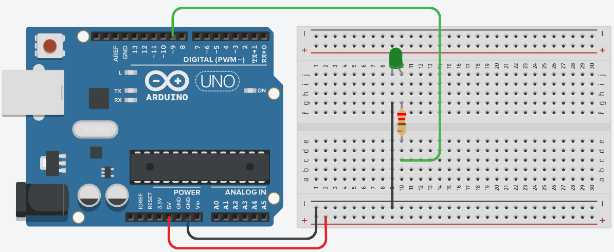
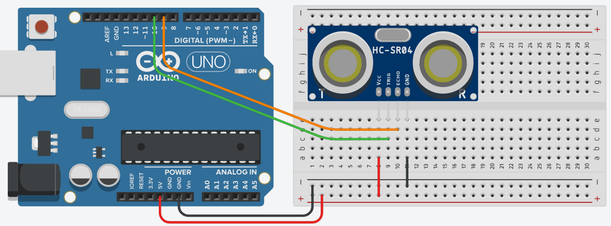

Making Things with Arduino Workshop

#### Table of Contents

[Introduction](#introduction)

[What We Will Learn](#what-we-will-learn)

[The Basics of Arduino](#the-basics-of-arduino)

[The Arduino Development Environment](#the-arduino-development-environment)

[Project 1 - Arduino Hello World](#project-1)

[Project 2 - Using a Distance Sensor](#project-2)

[Project 3 - Monitoring Your Environment](#project-3)

[Project 4 - Motion Sensor](#project-4)

[Resources](#resources)


----

## Introduction

Building fun electronic projects is a great way to jumpstart your imagination and creativity, which benefits both work and life. This workshop will be an introduction to the amazing world of DIY electronics. It will introduce you to the Arduino ecosystem, which provides an easy, friendly platform to learn the basics of electronics, prototyping cool gadgets, and IoT (Internet of Things).


### What We Will Learn

You will learn the how to use the Arduino development environment, putting together project prototypes, how to build your own projects using motion sensors, temperature and humidity sensors, and LEDs, and how to find and use resources that will help you go further to build anything you can imagine!

No experience with electronics or coding is required, but some basic knowledge of coding would definitely help speed things along. Everything you need to participate in the workshop is provided in a [complementary kit](https://goo.gl/FcvwX3) that is meant to be suitable for beginners, while also providing the basis for some interesting projects.

The kit contains the following:

- Arduino UNO R3 board (clone)
- Breadboard
- Ultrasonic distance sensor
- Temperature and humidity sensor
- Infrared motion sensor
- Buzzer
- Buttons
- LEDs (red, green, and blue)
- Resistors
- Jumper wires
- USB cable

The source code for each iteration of the workshop projects, as well as numerous samples for additional projects, is available in the workshop's [github repo](https://github.com/davidalexisnyt/Making-Things-Arduino-Workshop/tree/master/code).

### What is Arduino?

Arduino started as a way to provide an inexpensive platform for electrical engineering students, with an emphasis on cost, ease of use, and ease of programming. 

The name Arduino refers to many things:

- The Arduino company that creates the hardware and software
- The Arduino boards
- The Arduino IDE that is used to program the boards
- The software platform and set of built-in code libraries

The Arduino hardware and software are open source.  Arduino publishes the hardware design for all their boards, and encourages others to create their own boards based on the designs.  Therefore, it is incorrect to refer to Arduino "clones" as "knock-offs" or fakes, since they are simply implementations of open source designs. You too can build your own "Arduino" board!  As a matter of fact, building one is a fun and rewarding challenge.

Here is a wonderful video that gives a very good introduction to the Arduino platform: 

https://www.youtube.com/watch?v=nL34zDTPkcs


## What can be done with Arduino?

What can you to with Arduino or DIY electronics in general?  Anything you can imagine!  

Here are just a few products you might know that started as an idea and prototyped using Arduino or similar microcontroller platform:


**Keurig Coffee Maker**


**Microsoft HoloLens**


**Pebble Smartwatch**


The Arduino platform is the most popular DIY electronics platform for building home automation and security, robots, drones, and prototypes for commercial products.


----

## The Basics of Arduino

### The Board


- Main components
    - Atmel microcontroller - The Uno is built around the Atmega328 microcontroller
    - GPIO (General Purpose Input/Output) pins
    - Voltage regulator
    - Oscillator
    - Serial communications
- Pins
    - Digital pins 
    - PWM pins
    - Analog pins
    - Power pins
- Power
    - USB
    - power plug
    - VIn pin for connecting external power source, like batteries


### Working with a Breadboard


**Breadboard Layout**

One of the most important tools in the electronics prototyping toolbox is the **breadboard**.  It is used to build circuits and connect components in a non-permanent way. Once you've built and tested the circuit, you can then move on to soldering it in a more permanent, and more compact, way on **perfboard** or a specially designed printed circuit board (**PCB**). 

A breadboard is like a pin cushion for connecting things, with a grid of holes that are connected electrically.  There are two parts to a breadboard - the main area consisting of groups of **terminal strips** where components are inserted and arranged, and the **power rails** along the top and bottom.

Here we see how a breadboard is connected internally. 


The main area consists of a two separate grids of holes arranged in usually 30  or more columns (labeled 1 through 30) of 5 holes (labeled a through e, and f through j), separated by a groove. Each column of 5 holes is called a terminal strip. All of the 5 holes (or **tie points**) in a column are connected together internally. 

The power rails are along the top and bottom of the breadboard, and each consists of two strips of tie points.  The power strip (+ve voltage) is marked with a **+** and a red line.  The ground rail is marked with a **-** and a line that is either black or blue.

Power and ground are typically fed to the breadboard from the 5V (or 3.3V) and GND pins on the Arduino, and the strips are then used to feed power and ground to components of your circuit.  We'll see this in action later.


## The Arduino Development Process

Arduino projects include both hardware (Arduino board, sensors, LEDs, etc) and software (the code that runs on the Arduino and makes it do interesting things).  One is useless without the other.  Arduino code is written in a trimmed down flavor of the C/C++ languages.  Writing code in C may seem daunting at first, but the environment tries hard to make it as easy as possible.  

The process of developing a cool Arduino project includes:

- Thinking about what you want to build
- Research similar builds, tutorials, etc
- Determine which components are needed and obtaining them
- Build a prototype with components on a breadboard
- Write the code in the Arduino IDE
- Compile the code
- Upload the code to the Arduino
- Debug any issues
- Bask in the glory of your creation!

As we go through the workshop projects, we will cover the knowledge necessary to put all this together.


### Bare Minimum About Electricity

Although we can get by with simple projects with only a basic understanding of electricity, it will become vital to have some core knowledge fairly quickly.  There are excellent sources for beginners on the Web, like [adafruit.com](https://learn.adafruit.com), [sparkfun.com](https://learn.sparkfun.com/?_ga=2.105086019.1157387685.1552744919-2045258891.1552002583), [Electronics Tutorials](https://www.electronics-tutorials.ws), and the [Arduino](https://www.arduino.cc/en/Guide/HomePage) company site.  One recent book that is very good is [Mastering Arduino](https://www.packtpub.com/hardware-and-creative/mastering-arduino), by Jon Hoffman. 

You don't have to be an electrical engineer to be good at DIY electronics and to have fun with it, but a basic understanding of [Ohm's Law](https://www.electronics-tutorials.ws/dccircuits/dcp_2.html) is important for making your circuits stable and understanding why your LEDs keep burning out.  The wonderful thing about the Arduino platform is that it is designed to be very forgiving and to facilitate learning, but is flexible enough to take you all the way to very complex and professional projects.

However, a wise person once said that experience is directly proportional to the amount of equipment ruined.  To this end, it does not hurt to load up on lots of cheap Arduino clones, LEDs, and other basic components while learning. Making a mistake and having a board or LEDs go up in smoke is fun and an excellent learning opportunity!


### Setting Up Your Arduino Environment

The Arduino integrated development environment (IDE) is a key part of working with Arduino boards, since it compiles your code, lets you know if there are any errors, provides libraries and tools to make interacting with boards seamless, uploads (programs) boards with your project's code, and provides a connection to your board for debugging.

We must first download the software from the Arduino site ([](https://arduino.cc)) and install it.  Go to the site's Downloads section (https://www.arduino.cc/en/Main/Software).  Arduino offers two options - the Arduino IDE (which is installed locally on your computer) and the Web Editor (which is a web-based, cloud-hosted environment).

**Arduino IDE**

If you decide to use the Arduino IDE, scroll down to the "**Download the Arduino IDE**" section and click on the download for your computer (Windows, Mac, Linux).  Once the download is complete, launch the installer and follow the prompts to get the software installed.

**Web Editor**

The Web Editor is a great option, since all of your project code is stored up in the cloud and accessible from anywhere.  Using the Web Editor requires signing up for an account on the Arduino site at https://create.arduino.cc/.  It also requires the installation of a browser plugin and drivers that allow the browser to connect to boards connected to your computer in order to upload compiled code.  To install this plugin, click on the **Getting Started** block on the main create.arduino.cc site, scroll to the bottom of the page, and click on the link to install the plugin.  Once the plugin is installed, you're ready to go!

#### Potential issues

Windows and Linux PCs should be ready to roll, but Macs with High Sierra or newer MacOS version installed may have problems recognizing many Arduino boards. You will be able to tell is something is wrong if you connect your board to your computer, and a new entry does not show up in the Arduino IDE under the <kbd>Tools</kbd> > <kbd>Port</kbd> menu.

1. Launch the Arduino IDE, without the board connected
2. Go to the <kbd>Tools</kbd> > <kbd>Port</kbd> menu and take note of the items listed
3. Connect your board, then go back to the <kbd>Tools</kbd> > <kbd>Port</kbd> menu

If no new entry is listed, then your Mac does not know how to play well with others.

If you have issues with the board we're using for this workshop, you may need to install drivers from the product page at https://www.addicore.com/Black-UNO-R3-p/ad308.htm.  The download link for the Mac driver is located in the Resources section of the page.  You may have to reboot after installing the driver.

> **NOTE:** Some people had issues with the driver from the Addicore site on MacOS High Sierra.  They had better luck with the instructions from this site:  https://github.com/adrianmihalko/ch340g-ch34g-ch34x-mac-os-x-driver


OK!  Enough yammering.  **Let's get building!**


----

## Project 1

### Arduino Hello World

#### What We'll Build

The traditional first program someone writes when learning a new programming language is the venerable "Hello World!" program.  It is the bare minimum program that simply prints "Hello World!" to the screen.  With Arduino, this traditional first project is **Blink** - a circuit that simply blinks an LED.

This diagram shows how what the circuit will look like.




#### Getting Ready

For this project, we're going to need the following:

- Arduino board.
- 1 LED.  Any color LED is fine.  If you will be using an RGB LED (a single LED that can display red, green, and blue), then we will be using a single color only.
- 1 100 Ohm resistor.  Any value is fine for now, but a value of 100 - 220 Ohms would be preferable.
- Jumper wires.
- Arduino IDE - installed and configured.  The Arduino Web Editor is a great alternative that requires a minimal installation of a browser plugin, but requires an account on the Arduino.cc website.

#### Build It

#####  Wire up the circuit

Construct the LED circuit as shown in the diagram:

1. Insert the LED into the breadboard as shown, so that the longer leg (the positive lead) is on the right.
2. Connect a jumper wire to one of the ground (**GND**) pins of the Arduino, and the connect the other end of the wire to the same terminal strip (column) as the left leg of the LED (i.e. one of the holes in the same column as the LED's left leg).
3. Connect the resistor in the breadboard so that one end is in the same terminal strip as the positive leg (right side) of the LED.
4. Connect  a jumper wire between pin 9 of the Arduino and other leg of the resistor.

#####  Write the code

Now that the circuit is wired up, we need to tell the Arduino how to flash the LED.

Launch the Arduino IDE (or the Web editor).  By default, the IDE will open a new "Sketch" with a generated name.  If you are using the Web editor, click the New Sketch button.  

Replace the contents of the Sketch in the editor with the following code:

```c
void setup() {
    pinMode(9, OUTPUT);
}

void loop() {
    digitalWrite(9, HIGH);    
    delay(1000);  
    digitalWrite(9, LOW);    
    delay(1000);
}
```

Save the Sketch using <kbd>Ctrl</kbd>+S  (<kbd>Cmd</kbd>-S on a Mac).  You will be prompted to enter a new name for the Sketch.  Enter a good name - like "HelloWorld" or "Blink".

#####  Upload the Code

Now that the code is written, we need to compile it and get it onto the board.

Make sure that your board is connected to your computer with a USB cable.  Then ensure that your board is selected and configured in the IDE using the <kbd>Tools -> Board</kbd> and <kbd>Tools -> Port</kbd> menus. 


To compile and upload the code, click on the **Upload** button.


>  The keyboard shortcut for uploading is <kbd>Cmd</kbd>+U on the Mac, and <kbd>Ctrl</kbd>+U on Linux/Windows.

This will compile the code to a "hex" file that is executable by the microcontroller on the Arduino board, then upload the file to the board.  The IDE displays progress indicators about the compile and upload.

Once the upload successfully completes, the Arduino will automatically start executing the code, and you should see the LED blinking!


#### How It Works

Arduino programs are written in the C or C++ programming languages.  One of the goals of the Arduino creators was to provide a programming environment that would be relatively easy for people with little or no programming experience to get things done quickly.  At the time, microcontrollers were expensive and were programmed with assembly language or C with complicated tools and processes.  The Arduino language is still C, but wrapped inside a relatively simple IDE and compiler toolset, with a rich, but simple set of built-in functions.  Instead of having to worry about tons of C code that interacts with the Arduino's hardware, Arduino programs typically contain (or begin with) two simple C functions that the Arduino system calls.

```c
void setup() {
    
}

void loop() {
    
}
```

The ```setup()``` function runs when the Arduino is first powered on or reset, and runs only once. It is used to do initialization and anything else that should only be performed once.

The ```loop()``` function repeats continuously, and is the actual "meat" of your project.  It is basically an infinite loop that runs from top to bottom, then starts at the top again.  This is important to keep in mind when thinking about how you structure the code in this function and how it affects the behavior of your project.

When an Arduino Sketch, as projects are called, is compiled, it is first translated to pure C, combined with all the built-in code and wrappers Arduino provides, then finally compiled to a "hex" file specifically for the particular board you select.  Hex files contain the raw, binary executable code that the microprocessor executes.

Simple projects, like our Blinky, contain only setup() and loop(), but as we get into more complicated projects, we'll start ... C-ing more. ;D

Now, let's see how the code for our project works.

First, we have the ```setup()``` function:

```c
void setup() {
    pinMode(9, OUTPUT);
}
```

This code is typical of what you would find in ```setup()```. This code calls the built-in Arduino ```pinMode()``` function, which configures a pin on the board to behave a certain way.  In this case, we are telling the Arduino that we intend to use pin **9** for **OUTPUT**, meaning we'll be sending data to the pin rather than reading data.  LEDs are output devices, since we send signals to them telling them to turn on or off.  An LED is a light emitting diode, meaning that it lights up when an electric current flows through it in one direction and it blocks current from flowing the opposite way. 

After ```setup()``` finishes, the Arduino then runs the ```loop()``` function repeatedly until it is reset or powered off.  Let's look at the code in ```loop()```.

```c
digitalWrite(9, HIGH);    
delay(1000);  
digitalWrite(9, LOW);    
delay(1000);
```

The code calls Arduino's built-in function ```digitalWrite()```, which sets the state of a specified *digital* pin - digital pins can either be on or off. The first parameter to the function specifies the pin number on which to act, and the second parameter specifies the value to which the pin should be set.  Digital pin values can either be ```HIGH``` (full voltage, or **on**) or ```LOW``` (no voltage, or **off**).  The first call - ```digitalWrite(9, HIGH)``` - tells the Arduino to set pin 9 to the ON state.  Once this line is executed, the LED will turn be on.

Next, we see a call to the built-in ```delay()``` function, which tells the Arduino to basically do nothing for a specified number of milliseconds.  So ```delay(1000)``` means do nothing for 1 second.

The next line of code says ```digitalWrite(9, LOW)```, which sets pin 9 to the **off** state.  The LED's light will now be off.

The effect of these 3 lines of code is that to flash the LED for 1 second by turning it on, waiting 1 second, then turning it off.

But then, why do we need that second call to ```delay(1000)``` at the end of the ```loop()``` function?  Remember that the ```loop()``` function runs repeatedly, so as soon as the last line of code is run, the program will start again at the first line.  If there was no delay after we turn off the LED, the effect will be that it would be off for a tiny fraction of a second before the first line runs and turns it back on.  To the human eye, the LED would be always on!

Experiment with the value of the last delay() call - e.g. delay(2000), delay(100), etc - to see how it affects the behavior of the LED.


#### Going Further

The code we have for the "Hello World" Blinky LED is ok, but we can do better.  What if we want to do something like 4 rapid flashes followed by a long delay, or a number of rapid flashed punctuated by a longer flash?  Or what if we have multiple LEDs we want to flash?  The code could become long and unwieldy pretty quickly.

Let's refactor the code a bit to make things easier and cleaner:

```c
const int LED_PIN = 9;

void setup() {
    pinMode(LED_PIN, OUTPUT);
}

void loop() {
    flashLed(LED_PIN, 250
    flashLed(LED_PIN, 250);
    flashLed(LED_PIN, 1000);
}
          
void flashLed(int ledPin, int duration) {
    digitalWrite(ledPin, HIGH);
    delay(duration); 
    digitalWrite(ledPin, LOW);
    delay(duration);
}
```

We've defined our LED pin on one place by creating a *constant*.  Now, if we want to use a different pin, we need to change only one place in the code. Plus, we don't have confusing code everywhere referring to "9".

We've extracted the code that flashes the LED into its own function with parameters to specify the pin we want to flash and how long the flash should be.  This allows us to easily add flashes in our code with a single line of code instead of 4.

In the ```loop()``` function, we can now do some fancy stuff like do 2 rapid flashes followed by a longer flash.  Notice that the final delay() call was also removed, since the delay is built into the flash() function!


#### Going Even Further

Let's make Blinky a little more interactive.  We're going to learn how to use a button as input to control when the LED goes on.


1. Insert a button onto the breadboard as shown.  There are four pins on the button - two on each side opposite each other.  Make sure that the button straddles the groove in the breadboard, such that both pins of a given pair are on the same side.
2. Connect a resistor (a value between 10K to 20K is best) between one button pin and GND.
3. On the same side of the button, use a jumper wire to connect the other button pin to the power rail.
4. Use a jumper wire to connect the button pin that is opposite to the one with the resistor to pin 7 on the Arduino.

Now let's refactor the code to light the LED when it detects that the button is pressed.

```c
const int LED_PIN = 9;
const int BUTTON_PIN = 7;

void setup()
{
    pinMode(LED_PIN, OUTPUT);
    pinMode(BUTTON_PIN, INPUT);
}

void loop()
{
    if (digitalRead(BUTTON_PIN) == HIGH)
    {
        flashLed(LED_PIN, 500);
    }
}

void flashLed(int ledPin, int duration) {
    digitalWrite(ledPin, HIGH);
    delay(duration); 
    digitalWrite(ledPin, LOW);
    delay(duration);
}
```

Compile and upload the sketch, and see how it works!


### What We've Learned So Far

So far, we have learned how to 

- Use a breadboard
- The basics about our Arduino board
- How to define input and output components
- Do some interesting things with LEDs
- How to use a button
- Writing a basic program and even refactoring it to make reusable functions

Subsequent projects will build on this knowledge to give you a good understanding and give you the confidence to do amazing things!


----

## Project 2

### Using a Distance Sensor

#### What We'll Build

For this project, we'll use the ultrasonic distance sensor to build a device like a parking assistant that will let us know when we are within a good distance from the wall, when we're getting too close, and when should really just stop the car before we put a hole in the wall.

The device will:

- Turn on a green LED when we get within a certain maximum distance from the sensor
- Flash the green LED when we get within the "getting close" range
- Turn on a red LED when we've reached the minimum distance

The final circuit for this project will look like this:


While building this project, we will also learn some new and important Arduino development skills.  We'll see how to use the Serial Monitor to see what's going on in our code while it's running on the Arduino.  We'll also learn how to use libraries (additional, 3rd party code) to simplify working with components like sensors.


#### Getting Ready

For this project, we're going to need the following:

- Our Arduino board
- 1 US-015 ultrasonic distance sensor
- 1 green LED
- 1 red LED
- 2 100ohm resistors


#### Build It

We're going to build this project in two steps.  The first step is working with the distance sensor, while also learning how to use the Arduino IDE's Serial Monitor to debug our code and get feedback about what's happening on the board.

The first step of our build will look like this:

 


#####  Wire Up the Circuit

1. Wire up the power from the Arduino to the breadboard.
    1. Connect a red jumper wire from the **5V** pin on the Arduino to the +ve (red) power rail on the breadboard
    2. Connect a black jumper wire from one of the **GND** pins on the Arduino to the -ve (black or blue) breadboard power rail
2. Connect the US-015 distance sensor to the breadboard as shown in the diagram by inserting its pins into the breadboard.  Take note of the sensor's 4 pins - VCC (power), Gnd (ground), Trig (trigger), and Echo.
3. Connect a jumper wire from the +ve power rail to the sensor's VCC pin.
4. Connect a jumper wire from the -ve power rail to the sensor's Gnd pin.

> **NOTE:**  The position of the sensor in the breadboard as depicted is not ideal, since the wires get in the way of the sensor's ultrasonic waves, which may lead to funky readings.  It is better to flip the sensor around so that it is facing away from any obstruction.  The important thing is that the wiring is correct: power is connected to the VCC pin, ground to the GND pin, the trigger pin connected to the Arduino's pin 10, and the echo pin connected to the Arduino's pin 9.  The pins are labeled on the sensor, so it is easy to check your wiring.


#####  Write the Code

Create a new Sketch in the Arduino IDE and add the following code.  We'll go over how this code works later.

```c
const int triggerPin = 10;
const int echoPin = 9;

int inches = 0;
int cm = 0;

void setup() {
    Serial.begin(9600);

    pinMode(triggerPin, OUTPUT);
    pinMode(echoPin, INPUT);
}

void loop() {
    // Clear the trigger
    digitalWrite(triggerPin, LOW);
    delayMicroseconds(2);

    // Send an ultrasonic ping for 10 microseconds
    digitalWrite(triggerPin, HIGH);
    delayMicroseconds(10);
    digitalWrite(triggerPin, LOW);

    // Reads the echo pin, and returns the sound wave travel time in microseconds
    int pingTime = pulseIn(echoPin, HIGH);

    // Convert the ping time to distance in centimeters
    cm = 0.01723 * pingTime;

    // Convert centimeters to inches
    inches = (cm / 2.54);

    Serial.print("Distance: ");
    Serial.print(cm);
    Serial.print(" cm or ");
    Serial.print(inches);
    Serial.println(" inches");

    // Wait for a short while before reading the sensor again
    delay(100);
}
```


#####  Upload the Code

Compile and upload the code to your Arduino.  Once the upload is done, how do we know what it's doing?  We can't see anything happening!  This is where the Arduino IDE's Serial Monitor comes into play.

Open the Serial Monitor in one of the following ways:

1. Go to the <kbd>Tools</kbd> menu and select <kbd>Serial Monitor</kbd>
2. Use the keyboard shortcut.  On the Mac, use <kbd>Cmd</kbd>+<kbd>Shift</kbd>+M.  On Linux or Windows, use <kbd>Ctrl</kbd>+<kbd>Shift</kbd>+M.

This will open a new window, and you may already start seeing text being output in the main area.  If nothing is being output or you see garbage, then the we may need to tweak the configuration of the Serial Monitor so it talks to the Arduino at the right speed. 


Look at the bottom, right corner of the Serial Monitor window.  The second item from the right is a dropdown that says "115200 baud".  Let's go back to the first line of the ```setup()``` function in the code:

```c
Serial.begin(9600);
```

This code is setting up a connection  to the Arduino at a speed of 9,600 baud.  The Serial Monitor needs to also be set to the same speed for things to work.  To fix this, click the dropdown and select "9600 baud". Soon we should see good text coming from our board!


If all is well, our sensor should be reading the distance of whatever is directly in front of it and we should be seeing the distances being printed out!  Experiment a bit by moving an object towards and away from the sensor to see what happens.


#### How It Works

This little project has introduced two new things so far - debugging Arduino projects using the Serial Monitor, and working with a cool sensor!  Let's dig into each one to see how they work.

##### Serial Monitor

The serial connection between an Arduino board and the computer it is connected to (via a USB cable) is used typically to send information from the Arduino to the PC so we can see what's going on in our Sketch as it runs. Data can also go from the PC to the Arduino over the serial connection, but that's beyond the scope of this project.

Before it can be used, the serial connection must be initialized, or set up.  In our first project, we learned about where we need to put any initialization or setup code in our Sketch.  Remember?  That's right - in the ```setup()``` function.

```c
void setup() {
    Serial.begin(9600);
    . . .
```

This line in the setup() function initializes our serial connection.  ```Serial.begin()``` starts the connection, and takes as its parameter, a number representing the speed at which we would like to communicate to the PC.  In this case, it is 9,600 baud.  That brings back memories of 1990's dialup connections! This is fast enough for basic debugging, but we can bump the speed up a bit if we're going to be rapidly sending lots of sensor data to the PC.

Remember, as we discussed before, that the Serial Monitor in the Arduino IDE must be set to the same speed.

Once our connection is set up, we can then sprinkle ```Serial.print()``` and ```Serial.println()``` calls anywhere in our code where we would like to send interesting information to the Serial Monitor for us to see.  We see this in action from lines 33 to 37.  We first call ```Serial.print("Distance: ");```, which just writes that text to the Serial Monitor.  Then we call ```Serial.print(cm);```, which writes out the value that is stored in the ```cm``` variable. The next lines write out the text " cm or ", then the value of the ```inches``` variable, then finally the text " inches".  Important to note here is that the first four lines call ```Serial.print()```, while the last line calls ```Serial.println()```.  The difference is that "print()" writes what it's told and leaves the "cursor" on the same line.  "println()", on the other hand, writes what it's told, then goes to the next line, like hitting <kbd>Enter</kbd> at end of a line of text.

Using Serial.print() or Serial.println() is a good way to see what the value of variables are at any given point, or to simply to see where the program is and what it is doing.

##### Interacting with the Sensor

The distance sensor uses the same technique as dolphins or submarines - it sends out a high-pitched burst of sound, then waits to hear the echo.  Once it gets the echo, it figures out the amount of time that passed between when the ping and the echo.  Knowing the speed of sound, we can then calculate the distance of the thing that the sound bounced off of (which is basically the distance it takes for sound to travel in half the time between the ping and the echo).

Now we're experts on sonar, so we can look at the code to see how our sensor works!

So, we know that we need to send a ping, and receive an echo.  Therefore, the sensor contains a sound generator (called a trigger) and what's basically a microphone to detect the echoed sound.  The sensor has two pins for controlling these functions - a trigger pin, which is our output, and an echo pin, from which we can read our reply or input.  The code on lines 1 and 2 define constants representing our trigger pin (pin 10) and echo pin (pin 9).  These can be any of the Arduino's available digital pins, but 9 and 10 are just the ones we're using in this project.

As we discussed previously, we need to tell the Arduino how we intend to use pins.  Where do we do this type of initialization or setup work?  That's right - the ```setup()``` function.  Looking at ```setup()```, we see two lines of code that do this:

```c
    pinMode(triggerPin, OUTPUT);
    pinMode(echoPin, INPUT);
```

These configure our trigger pin as OUTPUT, and our echo pin as INPUT.

Now let's look at the ```loop()``` function to see how we work with the sensor.  Notice:

- First, we must initialize the sensor and tell to get ready to do a ping/echo session.  We do this with a ```digitalWrite(triggerPin, LOW);```, then a delay for a short time to give the sensor enough time to initialize.
- We then turn on the trigger pin by setting it to HIGH, wait 10 milliseconds, then turn it off by setting it to LOW.  This has the effect of sending 10 millisecond ultrasonic burst.
- Next, we have a call to ```pulseIn(echoPin, HIGH);```, which says "Read the echoPin until it gets turned on (set to HIGH)", which will happen when the sensor detects the echo.  What gets returned from this call is the duration between the ultrasonic burst and when it heard the echo.
- Oh, we're not done yet!  Now we need to break out our high school physics to figure out the distance from the duration using the speed of sound:  ```cm = 0.01723 * pingTime;```.  This gives us the distance in centimeters, because, inches are so last century!  Ok, fine.  For the Americans in the room, line 31 converts centimeters to inches:  ```inches = (cm / 2.54);```


#### Going Further

##### Using a Library to Make Things Easier

Our code so far is quite lengthy and complicated.  We need to know how to initialize the sensor, send an ultrasonic ping for a given length of time, wait for the echo, and understand the speed of sound so we can then figure out how far away an object is by calculating the time taken for the ultrasonic burst to echo back to the sensor. We even have some code to convert centimeters to inches.  

***Whew!*  There must be a better way.**

There is. One of the basic truths of technology is that no matter what problem you have, someone somewhere has already solved it. (Or at least a part of it or something similar or...)  

This is where libraries come in. A library is a package of code that someone has already created to solve a problem or make something easier, and were kind enough to put it out there for us to use. Let's use a cool library called **[NewPing](https://bitbucket.org/teckel12/arduino-new-ping/wiki/Home)** that makes working with distance sensors really simple.

Before we can use a library, we need to install it into our Arduino environment.  Open the library manager in the Arduino IDE by going to the <kbd>Sketch</kbd> menu and selecting the <kbd>Include Library</kbd> -> <kbd>Manage Libraries...</kbd> option.  (The keyboard shortcut to open the library manager is <kbd>Ctrl</kbd>+<kbd>Shift</kbd>+I on Windows  and Linux, or <kbd>Cmd</kbd>+<kbd>Shift</kbd>+I on Mac.)

Once the library manager window is up, enter "ultrasonic" into the "*Filter your search...*" box.  A list of matching libraries will be displayed.  Scroll through the list and check out the descriptions and functionality of the various libraries.  We should see an entry for the **NewPing** in the list.  It describes the library, and provides a link to a library's home page. 

Click on the "Install" button at the bottom of the library's information block.  Close the window once the library is installed.

Now go to the <kbd>Sketch</kbd> menu again, hover over the <kbd>Include Library</kbd> option, then find and click on "NewPing" in the list. We should a new line get added to the top of our code:

```c
#include <NewPing.h>
```

Now let's refactor our code to use the library.  The final code should look something like this:

```c
#include <NewPing.h>

const int triggerPin = 10;
const int echoPin = 9;
const int maxDistance = 500;

NewPing sonar(triggerPin, echoPin, maxDistance); 

void setup() {
    Serial.begin(9600);
}

void loop() {
    // Get the distance reading in centimeters
    int distance = sonar.ping_cm();

    // ..Or we if we want to get the distance reading in inches use...
    // int distance = sonar.ping_in();
   
    Serial.print("Distance: ");
    Serial.print(distance);
    Serial.println(" cm");

    // Wait for a short while before reading the sensor again
    delay(100);
}
```

Notice a few interesting things about the new code:

- We no longer need to initialize the triggerPin and echoPin in the ```setup()``` function.  Instead, we now simply supply triggerPin and echoPin to the new code on line 10:  ```NewPing sonar(triggerPin, echoPin, maxDistance);``` This declares a new variable called of type NewPing.  This is a class defined by the NewPing library that wraps all the details of working with ultrasonic sensors.  This line defines a new object called "sonar", which we have initialized with our sensor pins and the maximum distance we care about detecting.  (As an exercise, read the documentation on the NewPing library to find out why this is needed.)
- We no longer need to deal with the inner workings of the sensor - how to initialize it to get it ready for doing a ping/echo, etc, how to send a ping, and how to wait for a response, and how to calculate the distance based on the speed of sound.  We just simply ask it to give us a ping response in centimeters (line 15) or inches (as shown in the comment on line 18).

Wow!  That's a lot cleaner, and we don't have to know the physics of sound!

"Well, why didn't we just do that from the beginning?!", you may ask. Because, learning. :)


##### Adding Lights

Great!  We have the distance sensor part of our project worked out.  But it's of no use if we need to hook up the serial monitor all the time.  Let's add some visual interactivity with LEDs.

 Wire up the LED as shown here:


1. Insert the red LED into the breadboard, taking note of position of the longer leg, which is +ve or pin. Insert the LED so that the longer leg is on the right, just to keep things clear.
2. Connect a jumper wire from the LED's ground pin (left leg) to the ground rail.
3. Connect a resistor to the LED's right pin as shown.
4. Repeat this process to connect the green LED and a resistor as shown.
5. Connect a jumper wire (use a red one to keep things clear) between the free end of the red LED's resistor and pin 7 of the Arduino.
6. Connect a jumper wire (use a green one to keep things clear) between the free end of the green LED's resistor and pin 5 of the Arduino.


#####  Modify the Code

Now let's modify our code to add support for the LEDs.  We can incorporate and expand on what we learned about LEDs in Project 1.  The new code includes 

- Lines 6 and 7, where we define the pins that we're going to use for the LEDs
- Lines 15 and 16 in ```setup()```, where we initialize the LED pins for output.
- Lines 28 - 39, where we add some logic to determine when to light up the different colors

```c
#include <NewPing.h>

const int triggerPin = 13;
const int echoPin = 12;
const int maxDistance = 500;
const int redLedPin = 7;
const int greenLedPin = 6;

NewPing sonar(triggerPin, echoPin, maxDistance); 

void setup() 
{
    Serial.begin (9600);
    
    pinMode(redLedPin, OUTPUT);
    pinMode(greenLedPin, OUTPUT);
}

void loop() 
{
    // Get the distance reading in centimeters
    int distance = sonar.ping_cm();
   
    Serial.print("Distance: ");
    Serial.print(distance);
    Serial.println(" cm");

    if (distance > maxDistance) {
        digitalWrite(redLedPin, LOW);
        digitalWrite(greenLedPin, LOW);
    }
    else if (distance > 10) {
        digitalWrite(redLedPin, LOW);
        digitalWrite(greenLedPin, HIGH);
    }
    else {
        digitalWrite(redLedPin, HIGH);
        digitalWrite(greenLedPin, LOW);
    }
    
    // Wait for a short while before reading the sensor again
    delay(100);
}
```

Compile and upload the code, and see how it works.  Notice that the logic works as follows:

- Turns off the LED if no object is detected, or the detected object is beyond the maximum distance we care about  (currently 500 centimeters).
- Turns on the green LED when an object is detected between 10 centimeters and our maximum distance.
- Turns on the red LED if the object is closer than 10 centimeters.

Notice that in order to turn on one color (e.g. red), we need to set its value to HIGH, but also set the value of the other LEDs to LOW to ensure that they are off.

Can you tell what the code would look like if we had to flip between three LEDs?  What about four?  It can get pretty messy, right?


##### Refactor Using PWM

Ok, so our proximity alert / parking assistant / personal space violation detector project works nicely!  But the code can be cleaner, while adding the cool capabilities, like pulsing, or varying the brightness the of LEDs instead of just flashing them.

How? We can use a technique called pulse width modulation ([PWM](https://www.arduino.cc/en/Tutorial/PWM)). This technique basically allows a digital device (like an LED) that only knows about ON/OFF to behave like if it handles a range of values like an analog device.  Essentially, we can vary the brightness of an LED by rapidly turning it on and off so that the total time that it is on in a given second (for example) varies.  If the average time the LED is *on* is low, then there is collectively less light being emitted, and we perceive the LED as being dim.  As the average amount time the LED spends being *on* gets longer, we perceive the LED as being brighter.  PWM can also be used to vary the speed of motors.

Not all of the digital pins on the Arduino board support PWM. The ones that do support PWM are labelled with a "~" next to the pin number on the board.  

Add the ```setColor()``` function to the code as shown from line 45 below: 

```c
#include <NewPing.h>

const int triggerPin = 10;
const int echoPin = 9;
const int maxDistance = 500;
const int redLedPin = 7;
const int greenLedPin = 6;
const int blueLedPin = 3;

int inches = 0;
int cm = 0;

NewPing sonar(triggerPin, echoPin, maxDistance); 

void setup() {
    Serial.begin (9600);
    
    pinMode(redLedPin, OUTPUT);
    pinMode(greenLedPin, OUTPUT);
}

void loop() {
    // Get the distance reading in centimeters
    cm = sonar.ping_cm();
   
    Serial.print("Distance: ");
    Serial.print(cm);
    Serial.println(" cm");

    if (cm > maxDistance) {
        setColor(0, 0, 0);
    }
    else if (cm > 50) {
        setColor(0, 255, 0);
    }
    else {
        setColor(255, 0, 0);
    }
    
    // Wait for a short while before reading the sensor again
    delay(100);
}

void setColor(int red, int green, int blue) {
    analogWrite(redLedPin, red);
    analogWrite(greenLedPin, green);
    analogWrite(blueLedPin, blue);
}
```

Then change the body of the ```loop()``` function as shown.  The setColor() function can be used to turn on red, green, and blue separately or combine them with various intensities.

Test out the code by passing different values for red, green, and blue to the setColor() function to see what happens!

##### Challenge 1

Our project currently uses just green and red LEDs.  Let's add a third color for when the detected distance falls within a middle range. 

##### Challenge 2

Separate LEDs are OK. But an RGB LED lets us to some really fun stuff by creating any color we want by mixing different combinations or red, green, and blue!  An RGB LED is basically three LEDs (red, green, and blue) squished into a single LED package. It has four legs - one leg each for red, green, and blue, with the fourth leg being either the common cathode (-ve pin) or common anode (+ve pin), depending on the type of LED.  How do we know which pin in which?  The easy way is, as with any electronic components you use, check the product page, which usually has a link to the component's [data sheet](http://bit.ly/AC312-RGB-D-CA-5).  Component data sheets can get very technical, but they give you all the information you need about how the component works and how you should safely use it.  Aside from whether it's a common cathode or common anode type, the most important thing to know about an RGB LED is which leg is the common cathode/anode.

Purchase an RGB LED and see what you can do to spice up this project!

##### Challenge 3

Build a "wireless measuring tape" that displays the distance to an object on a little screen.  For this one, you will need to get a display like the [SD-1306 OLED](https://www.addicore.com/OLED-128x64-Monochrome-p/ad304.htm) display.  This is somewhat of an intermediate-to-advanced-level project, but once you're comfortable with working with Arduino, it should not be too hard to achieve!

> **NOTE:**  The workshop code samples contain examples under the "project1" folder that show how to use PWM to fade the LEDs in and out, and how to use an RGB LED.


----

## Project 3

### Monitoring Your Environment

#### What We'll Build

One of the most popular things people build when getting into the world of Internet of Things (IoT) is a weather station.  This neat device sits outside, collecting data on current temperature and humidity levels, and even barometric pressure.  This data is then transmitted wirelessly to a base station inside your house, from where it is aggregated, turned into useful data about weather trends, and even performing forecasting based on historical trends.  Many of these projects actually transmit data to cloud-hosted services that perform aggregation and analysis of data from multiple sensor locations.

Ok, we're not actually going to build a complete weather station system, but we will learn to use one of the basic sensor devices of a weather station - a digital humidity and temperature (DHT) sensor.


Then we will discuss how you can take this project further to create a full-blown weather station!

> **NOTE:** The diagram does not show the sensor connected to a breadboard, however, the assumption is that you are inserting it into a breadboard like we have been doing thus far.  The key thing is that the wiring is as shown, with the power connected to the leftmost pin.  You can use this sensor without a breadboard as shown in the diagram, but you will need male/female jumpers instead of the male/male jumpers provided with the kit.


#### Getting Ready

For this project, we're going to need the following:

- Arduino board
- DHT11 sensor
- Jumper wires
- 1 10K resistor


#### Build It

#####  Wire Up the Circuit

1. Connect the 5V and GND pins to the power and ground rails of the breadboard, as was done in previous projects.
2. Insert the DHT11 sensor into the breadboard.
3. Connect pin 1 of the DHT11 sensor (leftmost pin) to the power rail with a jumper wire.
4. Connect pin 4 of the DHT11 sensor (rightmost pin) to the ground rail with a jumper wire.
5. Connect pin 2 of the DHT11 sensor to pin 2 of Arduino with a jumper wire.  This is the data pin from the sensor.
6. Insert a resistor (10 - 20K) between the DHT11 sensor's pin 2 (data) and pin 4 (power) pin. 

#####  Write the Code

This should be the entire circuit.  Now let's write the code.  So, we've hopefully learned our lesson from Project 2 about using libraries to make working with sensors easy.  For this project, we're going to be using a library from Adafruit, written by Limor "Lady Ada" Fried herself!

Start a new Sketch in the Arduino IDE, and open the Library Manager.  (Remember, we learned how to do this in the previous project?)  In the search box, enter "**DHT sensor**".  This should show a listing for the Adafruit library.  Click <kbd>Install</kbd>.  The library actually makes use of another Adafruit library, so we'll need to also install that one.  Enter "**Adafruit_Sensor**" in the search box.  This will bring back a long list of libraries, but we want one simply titled "Adafruit Unified Sensor".  Scroll through the list until you find it, then install the library.  Close the Library Manager.

Now enter the following code in the Sketch editor:

```c
#include <DHT.h>
#include <DHT_U.h>

#define DHTPIN 2
#define DHTTYPE DHT11

DHT dht(DHTPIN, DHTTYPE);

void setup() {
    Serial.begin(9600);
    Serial.println(F("Starting temperature and humidity readings"));

    dht.begin();
}

void loop() {
    delay(2000);

    float humidity = dht.readHumidity();    
    float temperature = dht.readTemperature(true);

    if (isnan(humidity) || isnan(temperature)) {
        Serial.println("Failed to read from DHT sensor!");
        return;
    }

    float heatIndex = dht.computeHeatIndex(temperature, humidity);

    Serial.print(F("Humidity: "));
    Serial.print(humidity);
    Serial.print(F("%  Temperature: "));
    Serial.print(temperature);
    Serial.print(F("°F  Heat index: "));
    Serial.print(heatIndex);
    Serial.println(F("°F"));
}
```

Compile and upload the code to the Arduino, then open the Serial Monitor.  Make sure that the speed is set to 9,600 baud, since that's what our Sketch has set in the Serial.begin() call. You should start seeing output showing humidity, temperature, and heat index readings!


#### How It Works

As we can see, it's actually not that complicated to get the sensor going. 

The first two lines with ```#include``` statements tell the compiler to find and include the referenced files.

```c
#include <DHT.h>
#include <DHT_U.h>
```

Files with the ".h" extension are C/C++ **header** files.  These files include definitions - like constants, class definitions, function signatures, etc.  Header files typically are used to refer to libraries, which have associated .c or .cpp files that contain the actual code of a library.  In this case, the #include files refer to the header files for the DHT sensor library that we installed.

If you know which header files to #include for a library, then you can just type in the #include statements manually.  However, the Arduino IDE makes things easy for us. If we start with a new, blank Sketch and we know we want to use the DHT library, then we can simply go the <kbd>Sketch</kbd> > <kbd>Include Library</kbd> menu, and click on the entry for "DHY sensor library".  The IDE pops in the required #include statements for us!

Including the DHT headers gives us access to the DHT class provided by the library.  The ```DHT dht(DHTPIN, DHTTYPE);``` line says that we want to define an instance of the DHT class, we want to call it "dht", and it should be initialized for us by calling the class constructor with a couple parameters - "DHTPIN" is our constant we defined a couple lines above to indicate which Arduino pin we will use to get data from the sensor; "DHTTYPE" is the constant in the lines above that defines which version of the DHT sensor (the DHT11) sensor we're using.

> Notice that in this sketch we use **#define** instead of the **const** keyword to define our constants.  Although the compiler ends up treating them the same in the end, they are actually two fundamentally different concepts.  The **const** keyword defines a variable that has a constant value - that is, a variable whose value cannot change throughout the life of the program.  A variable is a pointer to a spot in memory holding a value.  **#define**, on the other hand, is a macro - an instruction to the compiler that says "whenever you see the name 'DHTPIN' in my code, replace it with the number '2'".  In the end, it is as if you typed "2" everywhere instead of "DHTPIN".  The compiler, however, knows what you mean, and treats **const** variables the same way as **#define** in order to save precious memory.

But for most simple projects, you don't need to care about such things.  Just use "const" instead of "#define", since it has become the more accepted approach.

The DHT sensor needs to be initialized before use, but thanks to the library we're using, we don't need to know the details.  All we need is the ```dht.begin();``` call in the setup() function!

Now, we're ready to get data from the sensor!  In the loop() function, we read the humidity with a call to

```c
float humidity = dht.readHumidity();
```

This line defines a variable called "humidity" that holds a float (this is the C language's floating point data type), into which the result of the readHumidity() function of the "dht" object is stored.

Similarly, we read the temperature:

```c
float temperature = dht.readTemperature(true);
```

Next we see an interesting piece of code:

```c
if (isnan(humidity) || isnan(temperature)) {
    Serial.println("Failed to read from DHT sensor!");
    return;
}
```

This code validates the **humidity** and **temperature** variables using the isnan() function, which validates that the variable holds a valid number.  If we get invalid numbers from the sensor, then we don't want to use them in calculations and print statements.  Doing so may crash the program!  Remember, we're not dealing with an application that can just throw a Null Pointer Exception and let the operating system handle it.  There is no operating system!  When writing code for embedded hardware systems, you can't just "let it crash" like many programmers like to do with normal software.  If either of the variables is an invalid number, we call "return;" to skip the rest of the code in the loop() function.

Assuming we got good temperature and humidity readings, we can then calculate the heat index, or "real-feel" temperature:

```c
float heatIndex = dht.computeHeatIndex(temperature, humidity);
```

Notice that the DHT library provides us with a neat little function to do this calculation for us!

The rest of the code simply prints out the data to the Serial Monitor.


#### Going Further

What we have built is the core of a weather station!  You can take this project further by adding barometric pressure readings using a sensor like the [BMP180](https://www.addicore.com/BMP180-Barometric-Pressure-Sensor-p/230.htm).  This can help predict upcoming changes in the weather that are usually preceded by changes in are pressure.

It's no fun to have to look at your Serial Monitor all the time, so a great addition to the project would be to add a display.  The [SD-1306](https://www.addicore.com/OLED-128x64-Monochrome-p/ad304.htm) display is a tiny, inexpensive OLED screen that works great with Arduino.  A sample project that uses this display in a clock build is included in the resources provided alongside this course.  Get one of the displays, play around with the sample project to get a feel for working with the display, then add it to this project to make a little desktop weather gadget.

A weather station is not too effective at the "weather" part if it's a prototype on a breadboard connected to your computer.

You can make it a real IoT device that sits outside in your yard, sensing weather conditions, and transmitting the data wirelessly to a base station inside your house.  This can be done by using a smaller, more power-efficient Arduino board like the Arduino Pro Micro, or an [ESP8266](https://www.addicore.com/ESP8266-ESP-12F-p/ad483.htm). The ESP8266 is a fantastic little device the size of a small postage stamp that includes full WiFi capabilities, is more powerful than an Arduino (32-bit processor, compared to the 8-bit chip used by Arduino Uno) , can be programmed using the Arduino environment, and can cost as little as $2.  The ESP32 (produced by the same company as the ESP8266) includes WiFi and Bluetooth, and a dual-core 32-bit processor.  These chips have become the go-to platform for IoT devices and adding wireless capabilities to your DIY projects.  I would recommend starting with one of the [Adafruit ESP-based boards](https://www.adafruit.com/?q=esp), since they are very high quality, and made right here in New York.


----

## Project 4

### Motion Sensor

#### What We'll Build

We're going to use a passive infra-red (PIR) motion sensor to build a simple project that can become the core of a home security system or automatic light switch.  This project will simply turn on an LED whenever it detects movement.


#### Getting Ready

For this project, we will need:

- A PIR sensor
- 1 LED
- 1 100 - 220Ohm resistor
- 3 male/female jumper wires
- 4 male/male jumper wires


#### Build It

Most PIR sensors are not breadboard-friendly, meaning they can't be inserted into a breadboard like most other components because of the obstructive placement of capacitors and other components on the bottom of the sensor.  We're going to use male/female jumper wires, since the female end of the wire can directly connect to the pins on the sensor. (Wow... can tech be any more misogynistic with this male/female terminology?)

> **NOTE:**  Be very careful in wiring up this component so that the power is connected to the right pin and ground to the left.  Different manufacturers use different pinouts, with the power and ground pins in different positions.  See the details of the particular PIR sensor from our kit here:  https://www.addicore.com/PIR-Infrared-Motion-Sensor-HC-SR501-p/168.htm

Wire up the circuit as shown in the diagram:

1. Use a male/female jumper wire to connect the PIR sensor's ground pin (left) to the ground rail on the breadboard.
2. Use another male/female jumper wire to connect the PIR sensor's power pin (right) to the power rail.
3. Use one more male/female jumper wire to connect the sensor's middle pin (its data pin) to the Arduino's pin 2.
4. Connect the LED, as shown, to the Arduino's pin 3 


**Writing the Code**

Create a new sketch with the following code:

```c
const int pirPin = 2;
const int ledPin = 3;

int pirState = LOW;
int value = 0;
 
void setup() {
    pinMode(ledPin, OUTPUT);
    pinMode(pirPin, INPUT);
   
    Serial.begin(9600);
}
 
void loop(){
    // Read the PIR sensor value.
    // It will be HIGH when the sensor detects movement, otherwise LOW.
    value = digitalRead(pirPin);
    
    if (value == HIGH) 
    {
        digitalWrite(ledPin, HIGH);
        
        // This if statement construct is so that we only print output when the
        // sensor value changes, not every time we read it.
        if (pirState == LOW) {
            Serial.println("Motion detected!");
            pirState = HIGH;
        }
    } 
    else 
    {
        digitalWrite(ledPin, LOW); // turn LED OFF
        
        if (pirState == HIGH){
            Serial.println("Motion ended!");
            pirState = LOW;
        }
    }
}
```

Once you compile and upload this code, create some movement (e.g. with your hand) in front of the white dome of the sensor.  You should see the LED come on!  The LED will go off after about five seconds.  If you move again, the sensor will detect the movement and the LED will again turn on.


#### How It Works

The PIR sensor consists of two main parts:  A light-sensitive sensor that is sensitive to a specific band of infrared light, and the white dome that acts as a lens to pick up and concentrate incoming infrared light from many directions.  Living things, like humans and pets, emit infrared light because of the heat that they generate.  This is what the sensor picks up on.  When infrared light hits the sensor, it causes an electric current to flow, and this is what the Arduino reads.

You can actually see the sensor under the dome if you carefully pry the white dome off.

The same concept used in this project is how automatic lights are built - you walk into a dark room, and the lights automatically come on.  You can actually build something like that now by controlling a bigger, brighter LED or array of LEDs.


#### Going Further

Our Arduino kit came with a little piezo-electric buzzer, which produces tones when an electric current is applied to it.  Let's use the buzzer to implement an alarm that goes off whenever motion is detected.

Insert the buzzer in the breadboard, as shown, and connect one pin to ground and the other to the Arduino's pin 4.


Then add the playAlarm() function as shown in the code below.  Add a call to playAlarm() in the body of the *if* statement that checks for a HIGH value from the sensor:

```c
const int pirPin = 2;
const int ledPin = 3;
const int buzzerPin = 4;

int pirState = LOW;
int value = 0;
 
void setup() 
{
    pinMode(ledPin, OUTPUT);
    pinMode(pirPin, INPUT);
   
    Serial.begin(9600);
}
 
void loop(){
    // Read the PIR sensor value.
    // It will be HIGH when the sensor detects movement, otherwise LOW.
    value = digitalRead(pirPin);
    
    if (value == HIGH) 
    {
        // This if statement construct is so that we only print output when the
        // sensor value changes, not every time we read it.
        if (pirState == LOW) 
        {
            Serial.println("Motion detected!");
            pirState = HIGH;
        }
        
        digitalWrite(ledPin, HIGH);
        playAlarm();
    } 
    else 
    {
        digitalWrite(ledPin, LOW); // turn LED OFF
        
        if (pirState == HIGH){
            Serial.println("Motion ended!");
            pirState = LOW;
        }
    }
}


void playAlarm()
{
    tone(buzzerPin, 440, 200);
    delay(200);
    noTone(buzzerPin);
    delay(200);
}
```

The tone() function is used to generate sounds through the buzzer pin.  It takes 3 parameters: the buzzer pin, the frequency of the sound to be made (in this case, we're using 440Hz, which is the A note), and the duration of the sound.  Read more about the tone functions here: [Arduino Language Reference - Tone](https://www.arduino.cc/reference/en/language/functions/advanced-io/tone/)


-----

# Resources

### Course Resources

- GitHub repo: https://github.com/davidalexisnyt/Making-Things-Arduino-Workshop


## Learning Resources

**Arduino**  - https://arduino.cc.  Arduino is the Italian company that created the open source Arduino hardware and software platform.  They also produce the "official" Arduino boards.

**TinkerCAD** (https://www.tinkercad.com/dashboard?type=circuits) is a site run by Autodesk that provides a great resource for beginners to visually build circuits with Arduinos, a breadboard, and lots of sensors and components.  Not only does it give you the ability to test your circuits, but it also provides a visual coding environment, where you build your code by dragging and dropping blocks!  It then generates the actual Arduino code that you can download and run on your own board.   [Circuito.io](https://www.circuito.io/app) is similar site, that seems to be geared towards intermediate to advanced makers.

**Adafruit** (https://adafruit.com) is the electronics company founded and run by Limor "Lady Ada" Fried, who is a great engineer and influential woman in tech, and built one of the most important companies in the DIY electronics space. Adafruit manufactures their high-quality product right here in New York City!


Excellent book on Arduino: [Mastering Arduino](https://www.packtpub.com/hardware-and-creative/mastering-arduino)

[](https://www.arduino.cc/reference/en/)

[](https://learn.sparkfun.com/tutorials/what-is-an-arduino/all)

[](https://learn.sparkfun.com/tutorials/what-is-a-circuit)

[](https://acadgild.com/blog/everything-need-know-arduino)

[](https://makezine.com/2011/02/10/why-the-arduino-won-and-why-its-here-to-stay/)

[](https://www.postscapes.com/forum/arduino/47-if-arduino-is-for-prototyping-how/when-do-you-make-the-actual-product/)


## Shopping

- [Addicore.com](https://addicore.com)
- [AdaFruit.com](https://adafruit.com)
- Amazon
- [Microcenter](https://www.microcenter.com/)
- [Tinkersphere](https://tinkersphere.com/)

Then there's always EBay, Alibaba.com and Banggood.com


Now, go forth and MAKE!
